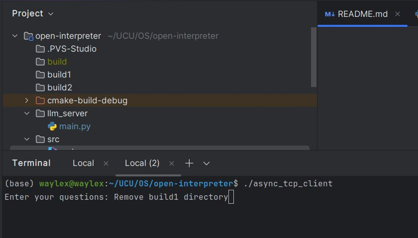
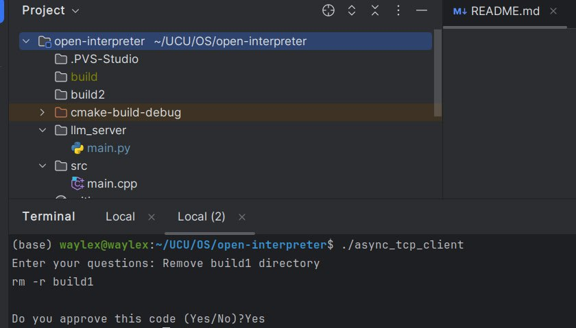

# open-interpreter

**Team**: Tkhir Nazar, Vysotskyi Mykola, Petro Prokopets, Severyn Shykula

## Project description
This project aims to create a Secure Terminal Assistant based on a **Large Language Model (LLM)**, either running **locally** or via an **API**. The assistant will be aware of the local computer's system information, enhancing both security and functionality. The model will provide intelligent responses and command execution tailored to the specific machine's environment, helping to manage tasks more securely.

## Installation

Install Boost:
```bash
$ sudo apt install libboost-dev-all
```

Install Python requirements:
```bash
$ python3 -m venv venv
$ source venv/bin/activate
$ pip3 install -r requirements.txt
```

Add `OPENAI_MODEL` and `OPENAI_API_KEY` to `.env` file in root of project:
```
OPENAI_MODEL=your_model # f.e. gpt-3.5-turbo
OPENAI_API_KEY=your_api_key
```

## Build
```bash
$ mkdir build && cd build
$ cmake ..
$ make
```
## Usage

Run Python server:
```bash
$ python3 llm-server/main.py
```
```
Serving on port 5000...
Received input: How to remove folder in Linux?
```

Run client:
```bash
$ ./build/client
```

```bash
Possible chats: 1,2,3,4
Choose a chat(0 to create a new chat): 0
New chat
Enter message ('exit' to quit): calculate 10-th Fibonacci number
'''python
def fibonacci(n):
    a, b = 0, 1
    for _ in range(n):
        a, b = b, a + b
    return a

tenth_fibonacci = fibonacci(10)
print(tenth_fibonacci)
'''
Safety of code: safe
Resources needed: 1 MB, 0.00001 seconds
Do you want to execute this code? (y/n):y
Executing Python script:

def fibonacci(n):
    a, b = 0, 1
    for _ in range(n):
        a, b = b, a + b
    return a

tenth_fibonacci = fibonacci(10)
print(tenth_fibonacci)

55
Python script executed successfully.
```

```bash
Enter message ('exit' to quit): create new file with name test.txt that contain 10 words Hello

'''shell
echo "Hello Hello Hello Hello Hello Hello Hello Hello Hello Hello" > test.txt
'''

Safety of code: safe
Resources needed: 0 MB, 0 seconds.
Do you want to execute this code? (y/n):y
Executing shell script:

echo "Hello Hello Hello Hello Hello Hello Hello Hello Hello Hello" > test.txt

Shell script executed successfully.
```

### Screenshots


